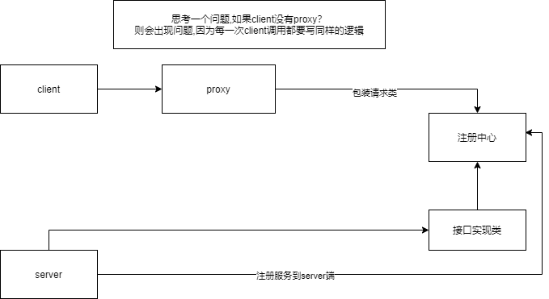

前面两个章节已经将service注册,并且能通过代理访问实现,现在问题是如何管理service
最简单的实现方式,是用map,存放service等信息

- 使用syncorized+concurrentHashMap
> 使用同步关键词,保证数据的一致性
> 顺带可以复习sync锁的升级过程,重入锁。concurrentHashMap的实现原理,cas+分段锁+链表/红黑树等等

- 线程池
> 线程池控制每一个server的单独请求,可以考虑优化这一点

- 具体可参考图
  

