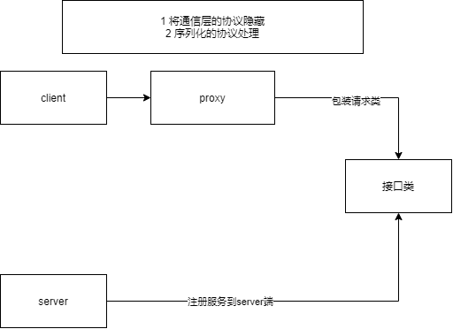

# 第一次技术点的融合

## 服务代理

## 代码部分

- 复制lessonOne的绝大多数代码

- 实现逻辑

  
- 方法实现类
```java

@Data
@Builder
public class RpcRequest implements Serializable {
    /**
     * 接口名
     */
    private String interfaceName;
    /**
     * 方法名
     */
    private String methodName;
    /**
     * 参数
     */
    private Object[] parameters;

    /**
     * 参数类型
     */
    private Class<?>[] paramTypes;
}
```
> 简单解释一下这个类的作用，为了远程调用像本地调用方法一样。因此需要知道代理的接口,方法等信息